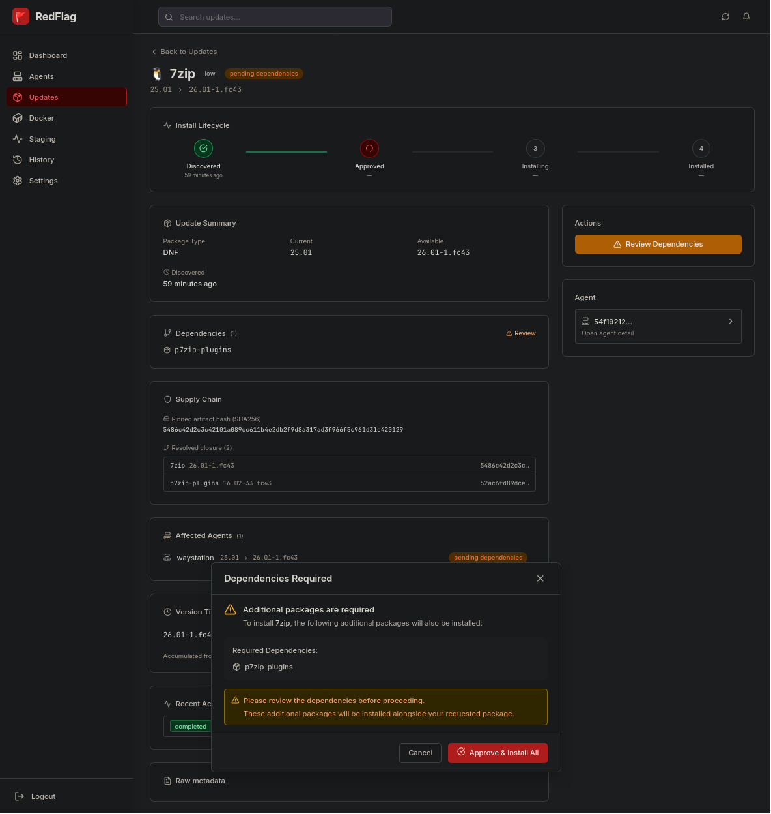
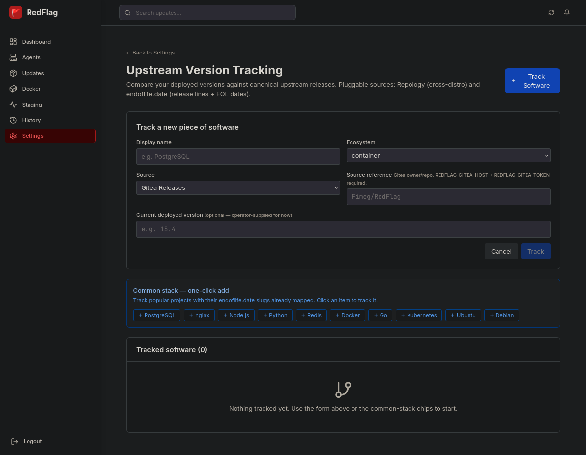

# RedFlag

**Understand and govern the machines you own.**

AGPL-3.0 · pre-release · **no tagged release exists yet**

> **You're early — over 1,000 of you cloned this before it was announced.**
> Build from source; there is no release artifact to download, and the release
> pipeline has not yet produced one. When a version is cut it will appear on
> Forgejo first, signed, and this line will say so instead.
> RedFlag is free and stays free — [here's who builds it, and why](AUTHOR.md).

### Where this lives

RedFlag is developed in a private forge and published outward through one
gated path. Three public copies exist and they are not equal:

| | | |
|---|---|---|
| **[forge.caseytunturi.com/Fimeg/RedFlag](https://forge.caseytunturi.com/Fimeg/RedFlag)** | **canonical** | The public source of record. Every public commit arrives here first, through a publication gate, and is verified anonymously before anything downstream moves. Inspect the code here. |
| [github.com/Fimeg/RedFlag](https://github.com/Fimeg/RedFlag) | mirror | A downstream copy of the exact Forgejo commit, for discovery and for issues. Nothing is developed here and nothing is published here first. |
| [codeberg.org/Fimeg/RedFlag](https://codeberg.org/Fimeg/RedFlag) | mirror, may lag | Best-effort. It is allowed to fall behind rather than hold canonical publication closed, so check its commit against Forgejo before trusting it. |

Public history begins at a deliberate projection epoch: the tree is constructed
from private source under a published path policy rather than being whatever
happened to sit on a branch. Each public commit carries `Source-Sha`,
`Policy-Sha` and `Tree-Digest` trailers binding it to what produced it.

---

<!-- Showcase video goes here: terminal → install → multiple agents → updates. -->

RedFlag is a local-machine operations console and a self-hosted fleet authority. The native Qt/QML Desktop asks what this computer is doing now: health, resources, processes, connections, services, containers, installed software, updates, security evidence, and history. RedFlag Web asks the same questions across many machines.

The Agent owns observation and machine state. Desktop expresses operator intent; it does not shell out to package managers, service managers, or Docker. With the default strict agent posture, privileged mutation crosses RedFlag's signed authority path or it does not happen. The fleet server cannot lower that posture remotely; an administrator with local control of the host can change it there.

What makes RedFlag different: the software that patches your fleet runs as root on every box, which makes it part of your attack surface — XZ Utils came through a build pipeline, SolarWinds came through an update. The server signs commands with Ed25519. Agents default to strict verification and reject anything forged or replayed; local host administrators retain authority over their own agent's enforcement posture. On APT and DNF, direct package mutation must cross a privileged Rust helper: a short-lived capability binds the host, operation, and artifact entries whose hashes resolved, and the helper validates that authority before executing a fixed argv plan with a cleared environment. Docker, Winget, and Windows Update still use the default-strict signed-command path. The full trust model is in [SECURITY.md](SECURITY.md).

---

|  |  |  |
|---|---|---|

<details>
<summary>More screenshots</summary>

|  |  |  |
|---|---|---|

|  |  |  |
|---|---|---|

|  |  | |
|---|---|---|

</details>

---

## RedFlag Desktop

Desktop is the native view of this machine, not a web dashboard wrapped in a window. It is built in Rust with Qt/QML and talks to the Agent over a local Unix socket or Windows named pipe.

The current Linux cut includes:

- live CPU, load, memory, swap, network, storage, and thermal history
- process inventory and drill-down with sockets, namespaces, capabilities, service/container ownership, and owning package
- systemd services, Docker containers and Compose stacks
- installed pacman, dpkg/APT, and RPM/DNF software inventory with dependency and file detail
- available updates, advisories, policy evidence, approval, and recorded override intent
- security posture and durable local history

The Windows local transport exists, but a Windows Desktop artifact waits for a native Qt/MSVC release runner. The web application remains the fleet surface; it is not embedded into Desktop.

---

## Quick Start

### Server

```bash
git clone https://forge.caseytunturi.com/Fimeg/RedFlag.git
cd RedFlag
cp config/.env.example config/.env
docker-compose build && docker-compose up -d
```

Open `http://localhost:31336`, complete the setup wizard, then restart:

```bash
docker-compose down && docker-compose up -d
```

### Agent

Get a registration token from **Settings → Token Management**, then:

**Linux / macOS:**
```bash
curl -sfL -H "X-Registration-Token: your-token" "https://your-server.com/api/v1/install/linux" | sudo bash
```

**Windows:**
```powershell
iwr -Headers @{"X-Registration-Token"="your-token"} "https://your-server.com/api/v1/install/windows" | iex
```

---

## What It Manages

| Platform | Package Managers / Scanners |
|---|---|
| Linux | APT, DNF, Docker (socket) |
| Windows | Winget, Windows Update (COM), Docker (socket) |

Agents run at the OS level and query the Docker socket directly — there's no separate container agent. Agents are pull-based: they check in every 5 minutes and execute what the server has approved. The server never initiates a connection.

---

## Security

The update manager *is* attack surface, so it gets treated like one: Ed25519-signed commands with replay protection, hardware-bound agent identity, rotating refresh tokens that burn loudly when stolen, and a separate privileged executor for APT/DNF mutation. The helper checks token version and time, host binding, signature, and replay state, then executes fixed package-manager argv without a shell or inherited environment.

The APT/DNF dry-run must resolve the top-level artifact hash before a capability can be minted. Successfully resolved dependency hashes are included, but unresolved dependency hashes can currently be omitted. The helper rehashes artifacts supplied by local path and refuses a missing or mismatched mirror artifact; normal registry entries without local paths are not rehashed helper-side. Its current `systemd-run` unit is short-lived but **not network-isolated**. Complete transitive closure pinning, local custody of every byte, and network isolation remain design work rather than implied guarantees.

The full trust model lives in [SECURITY.md](SECURITY.md), including how to report a vulnerability. The architecture and its honest gaps are documented in the RedFlag Architecture Framework (RAF).

---

## Architecture

```
┌─────────────────────────────┐
│  Server (Go)                │  PostgreSQL · Ed25519 Signing Service
│  Embedded React dashboard   │  Dashboard: 31336 · Agent API: 31337
└────────┬────────────────────┘
         │ Pull-based (agents check in, not the reverse)
         ├──────────────────┐
┌────────▼────────┐  ┌──────▼──────────┐
│   Linux Agent   │  │  Windows Agent  │
│                 │  │                 │
│  APT / DNF      │  │  Winget / WUA   │
│  Docker socket  │  │  Docker socket  │
└─────────────────┘  └─────────────────┘
```

---

## Features

- **Approval workflow** — updates queue for human review before anything runs
- **Maintenance windows** — day/time gates on when installs can proceed
- **Upstream tracking** — polls GitHub, Forgejo/Gitea/Codeberg, GitLab, Bitbucket for new releases; flags EOL drift
- **Drift detection** — knows what should be installed vs. what is, bridges the gap into update packages
- **Agent self-update** — SHA-256 → signature → atomic binary swap → service restart, reconciled server-side
- **Dependency dry-run** — checks before installing, not after
- **Idempotent installer** — re-running won't create duplicate agents
- **Proxy support** — HTTP/HTTPS/SOCKS5 for restricted networks
- **Native services** — systemd on Linux, Windows Services on Windows
- **Full audit trail** — all operations logged with context, sanitized against log injection
- **Native local console** — live machine health and operations beside the Agent, with no browser or cloud dependency
- **Connected inspection** — follow a process into its service, container, socket, capability set, and owning package

---

## Status

**Compiles, runs on the maintainer's stack, not yet battle-tested.** No live deployment outside the dev environment. The supply-chain gate has completed an end-to-end run (2026-06-05: `hyprutils` through capability-token minting, helper verification, and install on a live Fedora agent). Treat everything below as "implemented and locally exercised, not production-proven."

**Implemented:**
- Linux and Windows agent registration and update management
- APT, DNF, Winget, Windows Update, Docker image scanning
- Package state machine with enforced transitions and lifecycle orchestrator
- Failed state recovery: reopen, resolve, and transition out of failed
- Lifecycle history with status badges, version transitions, and failure reasons
- Scan-set closure reconciler (close-by-absence) — fixes out-of-band false positives
- Dry-run dependency checking with a mandatory top-level hash and best-effort transitive hash resolution
- Supply chain gate: OSV batch checks across reported resolved entries, vuln-is-a-full-stop enforcement for the checked set, audited override path
- Version soak-gating and package age gate as configurable policies
- Capability-token minting for dnf/apt with Ed25519-signed token verification
- Ed25519 key rotation and replay protection
- Maintenance windows
- Upstream version tracking (GitHub, Forgejo/Gitea/Codeberg, GitLab, Bitbucket, Repology, endoflife.date)
- Metadata pipeline: CVE details, upstream intelligence, package provenance
- Auto-discovery bridge (Repology, container registry, exact match)
- Agent self-update via privileged helper (zero agent sudo)
- Binary self-update (agent, helper, desktop) through the same signed, hash-pinned capability-token gate as package installs
- Process explorer: on-demand /proc scanning (sockets, capabilities, namespaces) with inode correlation
- Setup accepts an operator-supplied signing keypair — bring-your-own-key deployments
- Reversible token encryption with one-liner restore
- Real-time heartbeat and rapid polling
- Native Qt/QML Desktop source for health, performance, processes, network, storage, containers, services, software, updates, security, and history

**Not yet done:**
- No AUR, Snap, Flatpak, or Homebrew support
- macOS agent binaries not signed
- Mobile dashboard usable, not optimized
- Cert pinning and enforced TLS verification
- Complete transitive closure hashing for APT/DNF; unresolved dependency hashes can currently be omitted
- Helper-side rehashing of normal registry artifacts before mutation
- Network isolation for the privileged helper invocation
- Capability-helper execution for Docker, Winget, and Windows Update
- Native Windows Desktop release artifact and installer proof
- GPU telemetry, rich disk health, and vendor-specific power sensors

---

## Updating

```bash
git pull && docker-compose down && docker-compose build --no-cache && docker-compose up -d
```

Agent self-update runs from the dashboard. Requires a real service manager (`systemd` on Linux, SCM on Windows). Container-only agent deployments can't self-update through this path — redeploy with the new image instead.

If a self-update times out, the previous binary is preserved at `<binary>.bak` on the agent host. Restore manually and restart the service.

<details>
<summary>Nuclear option (full reset)</summary>

```bash
docker-compose down -v --remove-orphans && \
  rm config/.env && \
  docker-compose build --no-cache && \
  cp config/.env.example config/.env && \
  docker-compose up -d
```

This wipes all data including the database. Re-register agents afterward with new tokens.

</details>

<details>
<summary>Upgrading from pre-v0.1.20</summary>

Old installations used different paths. Clean reinstall is the supported migration path.

Remove old artifacts if present:
```bash
sudo rm -rf /etc/aggregator/ /usr/local/bin/aggregator-agent /var/lib/aggregator/
```

Then install fresh with the standard one-liner.

</details>

---

## Philosophy

RedFlag follows ETHOS:

- **Honest** — what you see is what you get
- **Transparent** — errors logged with full context, sanitized against injection
- **Secure** — hardware binding, cryptographic verification, local-only logging
- **Open standards** — no vendor lock-in, no cloud dependency, no telemetry

The maintainer runs this on their own infrastructure. Releases are versioned, migrations are idempotent. If something breaks, the error shows up in full — not swallowed into a generic failure message. Log output is sanitized against injection (ANSI stripping, control character replacement, field truncation) but the content is preserved.

Built for operators who'd rather own the problem than outsource it.

---

## Free, Forever

RedFlag will never be monetized. No pro tier, no cloud edition, no per-agent pricing — those are the things it exists to replace. This is my resume piece, built in the open and given away, because the update manager is part of everyone's attack surface — not just the orgs with an RMM budget.

The architecture documentation — the **RedFlag Architecture Framework (RAF)** — is being published alongside the code: how the system is built, why the design landed where it did, and the pitfalls we think are still out there. Not a guide to attacking it; the reasoning behind the madness, so you can judge the security model yourself instead of trusting a README. I haven't thought of everything — that's part of why it's published.

If community adoption takes off, ownership and contribution policies will be made transparent and stay open. This project does not get quietly captured.

If RedFlag holds your fleet and you want to give back: [sponsor the work](https://github.com/sponsors/Fimeg), or better — [hire the person who built it](AUTHOR.md).

---

## Changelog

See [CHANGELOG.md](CHANGELOG.md) for the full history. Recent highlights:

**v0.2.8.0** — Process explorer, self-update capability tokens, BYO signing keypair at setup, cross-compile CI matrix (linux-arm64, windows-amd64, darwin-arm64).

**v0.2.7.1** — CI/CD pipeline on Gitea Actions with release gate and guided release script. Screenshot capability survives self-upgrade.

**v0.2.6.8** — Dark/light tray app theme, desktop tray spine, prototype Tauri desktop app.

**v0.2.6.5** — Windows agent service logs now write to `C:\ProgramData\RedFlag\logs\agent.log`.

**v0.2.6.4** — Windows installer fixes: CRLF, reachable host, port preservation, Ed25519 cold-start tolerance.

**v0.2.6.2** — OSV scans moved to detection. Soak gate promoted to real policy. Dead scaffolding retired.

**v0.2.6.0** — Metadata pipeline, auto-discovery bridge, Docker enrichment, filter/search primitives.

**v0.2.5.1** — Failed state recovery, lifecycle history, reopen/resolve endpoints.

**v0.2.5.2** — Reversible token encryption. Idempotent heartbeat auto-queue.

**v0.2.3.5** — Unified agent+helper upgrade. Path traversal fixes. Self-update on fresh hosts.

**v0.2.3.1** — Supply chain gate hardened: vuln is a full stop. Ack tracking fixed.

**v0.2.2.0** — Package state machine enforced. Lifecycle orchestrator foundation.

---

## License

AGPL-3.0 — see [LICENSE](LICENSE).

**Third-party:** Windows Update integration based on [windowsupdate](https://github.com/ceshihao/windowsupdate) (Apache 2.0).
